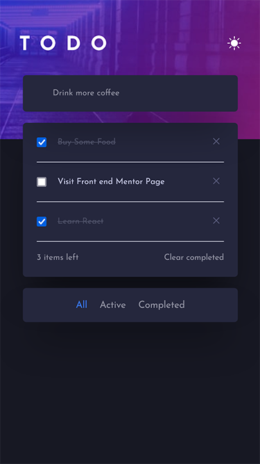
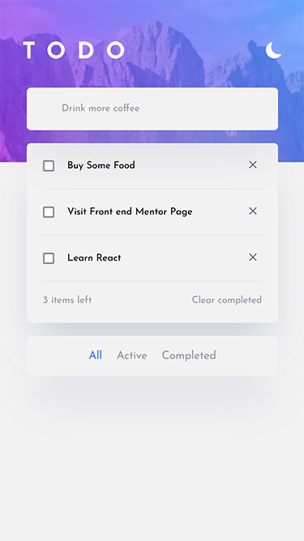

# Getting Started with Create React App

This project was bootstrapped with [Create React App](https://github.com/facebook/create-react-app).

## Start the project

Run:

### `npm start`

# Frontend Mentor - Todo App

This is a solution to the [Intro section with dropdown navigation challenge on Frontend Mentor](https://www.frontendmentor.io/challenges/todo-app-Su1_KokOW/hub/todo-app-oP82yrdzeM).

## Table of contents

- [Overview](#overview)
  - [Screenshot](#screenshot)
  - [Links](#links)
- [My process](#my-process)
  - [Built with](#built-with)

## Overview

User is able to:

- View the optimal layout for the app depending on their device's screen size
- See hover states for all interactive elements on the page
- Add new todos to the list
- Mark todos as complete
- Delete todos from the list
- Filter by all/active/complete todos
- Clear all completed todos
- Toggle light and dark mode

### Screenshot

### Links

- Solution URL: [code](https://github.com/waldekglaz/to-do-app)
- Live Site URL: [live](https://fem-to-do-app.netlify.app/)

## My process

### Built with

- React Js with CSS modules, [uuid](https://www.npmjs.com/package/uuidv4), [use-local-storage](https://www.npmjs.com/package/use-local-storage), [react-icons](https://react-icons.github.io/react-icons), [framer-motion](https://www.npmjs.com/package/framer-motion)
- Styled Components
- useState, useRef hooks
- Mobile-first

### Lighthouse Performance

- Mobile
  
- Desktop
  

## Author

- Frontend Mentor - [@waldekglaz](https://www.frontendmentor.io/profile/waldekglaz)
